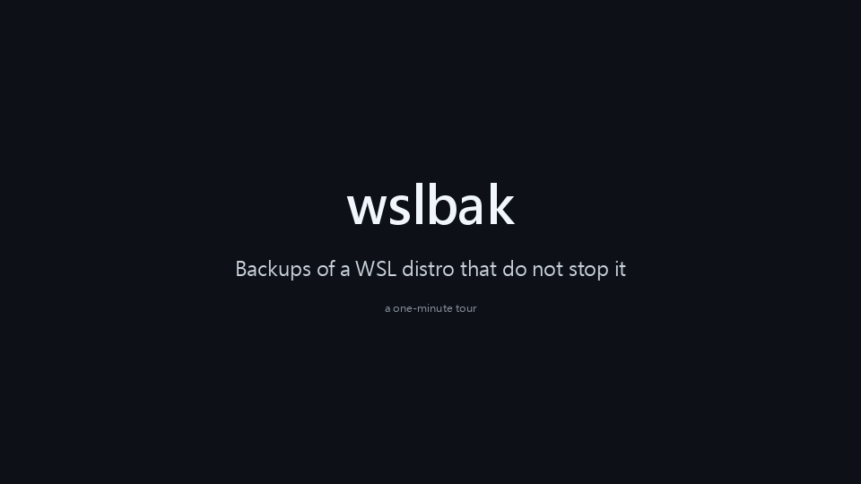

# wslbak

**English** | [繁體中文](README.zh-TW.md)

Scheduled backups of a WSL distro that do not stop it, a test restore after every backup, a
notification when something fails, and a one-line restore.



The same tour as a [video](docs/demo.en.mp4). It is recorded from real runs on a test distro; the
distro's name and the folder paths are shown the way a user would see them.

Files inside WSL are not covered by OneDrive or most backup tools: they live in one virtual disk, and
when that disk is damaged or Windows is reinstalled, everything in it is gone. The usual answer is a
scheduled `wsl --export`, but `wsl --export` terminates the distro before it exports, so your shells,
dev servers and containers die every time it runs. `wslbak` reads the distro from the inside instead,
while it keeps running:

```
> wslbak init
> wslbak run
Backing up Ubuntu-24.04 → D:\WSLBackup\Ubuntu-24.04
  wrote 20260115T030000Z.tar.gz (7.2 GB, 1 min 48 s)
  1 files or folders changed while being read (normal for a backup of a running system).
Test restore…
  test restore passed: all 512 sampled files match (1 min 33 s)
Done.
```

- **The distro is never stopped.** A root `tar` inside the distro streams it out; WSL is not shut down
  and nothing in the distro is written to.
- **Every backup is test-restored.** The archive is imported as a temporary distro, checked, and removed.
- **Standard format.** A backup is a plain `.tar.gz` that `wsl --import` accepts, with or without wslbak.
- **One command to set up**: a daily task, how many backups to keep, where they go.
- **Restore never overwrites.** A whole distro comes back as a new distro; single files come back into
  a new folder.

## Install

Requires Windows 10 or 11 and the Microsoft Store version of WSL (`wsl --version` must work; run
`wsl --update` if it does not).

With Node.js 18 or newer, from a Windows terminal or from inside WSL:

```
npm install -g wslbak
```

Without Node: download `wslbak-<version>-windows-x64.zip` (or `-arm64`) from the
[Releases](https://github.com/Boring206/wslbak/releases) page, unzip it anywhere, and run `wslbak.exe`
from there. Keep `wslbak.exe` and `wslbakw.exe` together.

Either way the executables are prebuilt, so Go is not needed. `wslbak init` copies them to a fixed
place of its own, so the download folder or the npm installation can change later without breaking
the schedule.

## Getting started

```
wslbak init
```

`init` looks at your distros, proposes a destination, and then shows everything it is about to create
— the files, the registry key, the scheduled task and its exact command line — before asking
`Proceed? [y/N]`. Nothing is changed until you say yes; `--dry-run` shows the same plan and stops.
No administrator rights are needed. With several distros it asks which one; `--all` sets up all of them.

By default backups go to `<drive>:\WSLBackup` on the internal drive with the most free space other
than the one holding the distro, so that they survive reinstalling Windows. An external drive or a
NAS share (`--dest`) also protects against the disk itself failing; `init` tells you when the
destination is on the same physical disk as the distro.

`wslbak doctor` checks the whole setup at any time and says how to fix what it finds.

## Usage

```
wslbak init              set up backups and the daily task
wslbak config            show the settings; with options, change them
wslbak run               back up now, test-restore, prune old backups
wslbak list              list backups
wslbak files [id] [path] list what a backup holds in a folder
wslbak status            schedule, last result, and whether the installed program is intact
wslbak doctor            check the environment and settings, with a fix for each problem
wslbak verify [id]       test-restore an existing backup again (default: the newest)
wslbak restore [id]      restore a backup as a new distro (default: the newest verified one)
wslbak uninstall         remove the task and the installed program; backups are kept

  -d, --distro <name>      which distro (default: the only one that can be backed up)
      --all                init: set up every distro that can be backed up
      --dest <folder>      init: where to store backups
      --keep <count>       init, config: how many of the newest verified backups to keep (default 7)
      --keep-weekly <n>    init, config: also keep one per week, for n weeks
      --keep-monthly <n>   init, config: also keep one per month, for n months
      --at <HH:MM>         init, config: time of the daily backup (default 03:00)
      --webhook <url>      init, config: also report failures to this URL; off removes it
      --notify <when>      config: failure (default) or always
      --verify <how>       config: restore (default) or none
      --exclude <pattern>  config: exclude one more path pattern (repeatable)
      --unexclude <pattern>  config: stop excluding a pattern (repeatable)
      --enable, --disable  config: turn backups of one distro on or off
      --private            config: let only your account open the backup folder
      --no-verify          run: skip the test restore this time
      --find <text>        files: list entries whose name or path contains this text
      --name <name>        restore: name of the restored distro
      --to <folder>        restore: where to put the restored distro
      --path <path>        restore: bring back only this file or folder (repeatable)
      --into <folder>      restore: put those files into this folder inside the distro
  -n, --dry-run            only show what would be done
  -y, --yes                do not ask for confirmation
      --lang <lang>        interface language: en or zh-TW
      --debug              show details and timing of each step
```

Exit codes: `0` success; `1` the backup was written but not verified, or `status`/`doctor` found
something that needs attention; `2` failure; `3` another wslbak is already running.

Inside WSL you can give Linux paths (`--dest /mnt/d/WSLBackup`); they are converted for you.

## Restoring a whole distro

```
wslbak restore
```

restores the newest backup that passed its test restore. If a distro with the original name still
exists, the copy is called `<name>-restored-<date>`; pick your own with `--name`. An existing distro
is never overwritten, changed or removed, and the restored one is not started for you.

**After reinstalling Windows**, you do not need Node or npm. Every backup run puts a copy of the
program and a `README-RESTORE.txt` into the backup folder. Install WSL, then:

```
D:\WSLBackup\wslbak.exe restore
```

**Without wslbak at all**, a backup is an ordinary archive:

```
wsl --import Ubuntu-24.04 C:\WSL\Ubuntu-24.04 D:\WSLBackup\Ubuntu-24.04\20260115T030000Z.tar.gz --version 2
```

A distro imported by hand logs in as root; add `[user]` and `default=<your user name>` to its
`/etc/wsl.conf` to change that. `wslbak restore` does this for you.

## Bringing back single files

Most of the time you do not need the whole distro, just the file you deleted yesterday.

```
wslbak files /home/me/project            what is in that folder in the newest backup
wslbak files --find notes.md             where is a file whose name contains this
wslbak files 20260114T030000Z /etc       the same for an older backup

wslbak restore --path /home/me/project/notes.md --into /home/me/recovered
```

`--path` takes a file or a folder and can be repeated. The files go into the folder given by
`--into`, inside the distro the backup came from, with their full path recreated underneath:
`/home/me/recovered/home/me/project/notes.md`. That folder must not exist yet, or be empty, so
nothing you have now is ever overwritten; move the files where you want them afterwards. Owners,
permissions, extended attributes and ACLs are preserved.

## What is backed up

Everything on the distro's root file system, with ownership, permissions, extended attributes, file
capabilities, hard links and sparse files. Left out by default: `/tmp/*`, `/var/tmp/*`, and the
`.cache` folders in home directories. Windows drives under `/mnt` are not part of the distro and are
never included.

```
wslbak config                                         show the settings
wslbak config --exclude "/home/*/Downloads/*"         leave something out
wslbak config --keep 3 --keep-weekly 4 --keep-monthly 6
wslbak config --at 02:30
```

- `--exclude` takes a path pattern inside the distro; `*` matches anything. Quote it, so your shell
  does not expand the `*` first.
- `--keep` is the number of newest verified backups. `--keep-weekly` and `--keep-monthly` keep one
  more per week or month on top of that. They do not make backups smaller; they spread the same
  number of copies over a longer time. To use less space, exclude what can be downloaded again:
  `wslbak doctor` measures the usual caches and prints the command for each.
- `--verify none` turns the test restore off; then the newest backups are kept regardless.
- `--notify always` also notifies on success, so that silence means the task is not running.
- Run `wslbak init -d <other distro>` to add another distro. One daily task covers all of them.

The settings are stored in `%LOCALAPPDATA%\wslbak\config.json`. Each backup is three files in
`<dest>\<distro>\`: `<id>.tar.gz`, `<id>.json` (size, SHA-256, warnings, the result of the test
restore) and `<id>.idx.gz` (the list of files, used by `wslbak files`). The id is the UTC time of
the backup.

## The test restore

After a backup is written, wslbak imports it with `wsl --import` as a temporary distro, runs a check
inside it, and unregisters it again. The check confirms that the default user and their home
directory exist, that 512 files, picked at random while the backup was being read, have the same
SHA-256 as they had then, and that the eight largest files have the size they had (too big to hash
every time, and the ones an importer is most likely to get wrong). Before that, the whole archive
is read back and compared with the SHA-256 recorded when it was written. If the importer complains
that it could not read part of the archive, the test restore fails even though WSL reports success.

The temporary distro must not come alive: all WSL2 distros share one network namespace, so a faithful
copy that boots would start a second set of your services and scheduled jobs, with your credentials.
wslbak therefore appends its own `/etc/wsl.conf` to the end of the stream it imports (the archive on
disk is not altered) that turns off systemd, boot commands, Windows drive mounts and interop, and it
refuses to start the copy unless that file is the one that ended up in place.

WSL makes a Start Menu folder for every distro it imports and does not always take it away again;
wslbak removes the empty one that its temporary distro leaves behind.

Only verified backups count towards `--keep`. Backups that could not be verified are kept separately,
at most two, so a run of failures never pushes out your good backups.

## Notifications

A failed or unverified backup raises a Windows notification. `--webhook <url>` adds a second channel:
[ntfy](https://ntfy.sh) topics get a plain-text message, Discord and Slack webhook URLs get their own
JSON format. The URL is treated as a secret: only its host name is shown or logged. Notifications say
what kind of problem occurred but never include file names; the details stay in the log on your PC.

`wslbak status` exits 1 and says so when the last success is more than two days old, when the task is
missing, or when the installed program has disappeared.

## Safeguards

- wslbak never calls `wsl --shutdown`, `wsl --terminate` or `wsl --unregister` on your distros. The one
  place that unregisters anything only accepts a temporary distro whose name wslbak generated, that
  is registered at exactly its own folder under `%LOCALAPPDATA%\wslbak\verify`, and that it left a
  claim file for. A test checks that no other code path can reach that call.
- Old backups are deleted one file at a time, and only files that have a wslbak manifest next to them.
  Other files in the backup folder are left alone, even ones that look like backups. Nothing is
  deleted in a folder that holds backups written by a newer version of wslbak.
- `restore` refuses a name that is in use and a folder that is not empty, for distros and for files.
- The scripts that run inside your distro never delete anything, and use nothing beyond the shell
  and coreutils. What you type for `--path`, `--into` and `--exclude` is never placed on a command
  line inside the distro.
- File names and messages that come from inside the distro are shown with control characters made
  visible, so a file with a crafted name cannot send commands to your terminal.
- Single files only go back into the distro the backup folder belongs to, whatever the records in
  that folder say. They are unpacked in a folder that only root can enter and moved into place when
  everything is there, so a user inside the distro who owns the folder above the target cannot
  redirect them by swapping the target for a link.
- Distros managed by another program (`docker-desktop*`, `rancher-desktop*`, `podman-machine-*`) and
  WSL1 distros are refused with a reason.
- Only one wslbak works at a time; a second one exits with code 3.

## How it works

`wsl.exe -d <distro> -u root -e sh -s` runs a small script inside the distro. The script runs GNU `tar`
on `/` with `--one-file-system` and writes the raw archive to stdout. On the Windows side wslbak
compresses it with parallel gzip, hashes it, and writes `<id>.tar.gz.partial`, which is renamed only
when tar reported success and the number of bytes received equals the number tar says it wrote.

One field of tar's output is filled in on the way. For a file of 8 GiB or more, GNU tar records the
size only in an extended header and leaves the size in the file's own header at zero. The importer
that ships with WSL 2.7 (bsdtar 3.7.7) believes the zero: such a file comes back empty, and
`wsl --import` still reports success. wslbak writes the real size into that header as well, so the
archive restores correctly there too. Nothing else is changed, and the archive stays a valid tar.

The scheduled task belongs to your Windows account and runs with your sign-in session. It starts a
windowless copy of the program kept in `%LOCALAPPDATA%\Programs\wslbak`, so it does not depend on Node
or on anything inside a distro. The task is set to run as soon as possible after a missed start and
again ten minutes after you sign in; the program then skips the run if a backup succeeded within the
last 20 hours.

## Limitations

- **Files that are being written during the backup may be inconsistent in it.** There is no snapshot.
  Databases should be dumped to a file by their own tools; the dump is then backed up reliably.
- **POSIX ACLs are not restored when a whole distro is restored.** They are stored in the archive,
  but `wsl --import` does not apply them. `wslbak run` tells you how many files are affected
  (systemd's journal folders, which are reset at boot, are not counted). Bringing back single files
  with `--path` does preserve them.
- **Backups are not encrypted.** A backup holds every file of the distro, private keys and password
  hashes included. Whoever can read the backup folder can read all of it, and whoever can write to
  it can alter a backup or the copy of the program kept there. `wslbak doctor` tells you when other
  accounts on the PC can read the folder, and `wslbak config --private` restricts it to your account
  (plus SYSTEM and Administrators). That is not done by default because of what it costs later:
  after reinstalling Windows your new account is not on the list, and you have to open the folder
  in Explorer and confirm its question, or use an administrator's terminal, before you can restore.
  Only verify or restore backups from a folder that nobody else can write to: a test restore runs
  programs that come out of the backup.
- **Every backup is a full copy.** There is no incremental mode yet.
- **GNU tar is required inside the distro.** A distro with BusyBox tar (Alpine as it comes) or with no
  tar (openSUSE Tumbleweed as it comes) is refused, with the command that installs it.
- **Only what is on the root file system.** A folder mounted from another disk is skipped, and
  `wslbak run` names it.
- **The test restore needs free space** on the drive holding `%LOCALAPPDATA%`, up to about the size of
  the distro's files. When there is not enough, the backup is kept, reported as not verified, and the
  exit code is 1.
- **The task runs only while you are signed in.** A stopped distro is started for the backup.
- **The test restore is a sample.** It proves the archive imports, that 512 files are intact and
  that the largest files have the right size, not that every byte of every file is.
- **Single files can only be brought back into the distro**, not straight into a Windows folder. From
  Windows, open the result at `\\wsl.localhost\<distro>\<folder>`.
- **Where it has been tested.** Developed on Ubuntu 26.04. The end-to-end suite passes against
  Debian 12 and 13, Ubuntu 20.04, 22.04 and 24.04, Fedora 44, AlmaLinux 8 and 9, Rocky Linux 9,
  Oracle Linux 7, 8 and 9, Arch Linux, openSUSE Tumbleweed, Kali, Gentoo, NixOS and Alpine 3.24
  (GNU tar 1.26 to 1.35); with WSL 2.7 and 3.0; on Windows 11 (build 26300), Windows Server 2025
  (build 26100) and Windows Server 2022 (build 20348, the generation of Windows 10); and with
  Avast and with Microsoft Defender's real-time protection switched on. The arm64 executables
  start and pass the unit tests on arm64 Windows, where no WSL was available to back up. Not tried
  yet: Windows 10 itself, a PC with Docker Desktop, and distros of 100 GB or more; reports are
  welcome.

## Troubleshooting

Start with `wslbak doctor`.

- **Where is the log?** `%LOCALAPPDATA%\wslbak\wslbak.log`, in English. Add `--debug` to see it live.
- **Windows refuses to start the program.** The executables are not code-signed. Smart App Control
  blocks unsigned programs outright, and wslbak cannot run while it is on; AppLocker or WDAC policies
  can do the same on managed PCs.
- **Antivirus holds the program the first time it runs.** Some products (Avast and AVG, for example)
  check a program they have never seen before for a while, or run it in a sandbox, and inside a
  sandbox wslbak cannot talk to WSL. `init` therefore starts the installed program once while you are
  there. If scheduled backups never run, add `%LOCALAPPDATA%\Programs\wslbak` to the antivirus
  exceptions. Do not turn the antivirus off.
- **`status` says the installed program is missing.** Antivirus software may have quarantined it.
  Restore it from the antivirus history, then run `wslbak init` again to put the files back.
- **"Cannot write to …" during init.** With Controlled folder access on, allow the program in Windows
  Security or choose a folder that is not protected.
- **`.exe` files stop working inside WSL ("Exec format error") after a Fedora distro stops.** This is
  not caused by wslbak: when a Fedora 44 distro shuts down, it clears a kernel setting that all your
  distros share. It can show up after a backup because a backup starts a stopped distro, which then
  stops again. `wsl --shutdown` fixes it, or, without restarting, from a Windows terminal:
  `wsl -u root sh -c "echo ':WSLInterop:M::MZ::/init:P' > /proc/sys/fs/binfmt_misc/register"`.
- **"cannot run Windows programs" inside WSL.** Windows interop is disabled; check `[interop]` in
  `/etc/wsl.conf`, or use wslbak from Windows instead.
- **In Git Bash, `--path`, `--into` and `files <path>` are refused as Windows paths.** Git Bash
  rewrites arguments that look like Linux paths (`/home/me` becomes `C:/Program Files/Git/home/me`)
  before wslbak sees them; wslbak notices and says so. Put `MSYS_NO_PATHCONV=1` in front of the
  command, or use PowerShell, cmd or a WSL shell.

## Development

Requires Go 1.26 or newer and Node.js. See [CONTRIBUTING.md](CONTRIBUTING.md) for the rules the code
keeps to, [docs/ARCHITECTURE.md](docs/ARCHITECTURE.md) for how it is put together, and [SECURITY.md](SECURITY.md) for
reporting a vulnerability.

```
npm test         # go vet plus unit tests
npm run build    # builds the four executables in bin/
npm run e2e      # end-to-end tests inside WSL, against a throwaway distro and a sandbox folder
npm run dist     # release zips, checksums, and winget and scoop manifests in dist/
```

`bash scripts/demo.sh` makes the tour at the top of this page again: it records real commands
against a throwaway distro and draws the recording. It needs a Python with Pillow on Windows.

`npm run e2e` creates a Debian distro named `wslbak-e2e-<random>` on first use; set
`KEEP_E2E_DISTRO=1` to keep it for the next run, and remove it with `scripts/e2e-distro.sh destroy`.
Set `E2E_DISTRO` to test another family (`FedoraLinux-44`, `archlinux`, `openSUSE-Tumbleweed`,
`alpine`, …), or `E2E_ROOTFS_URL` to import a root file system that `wsl --install` does not offer.
`E2E_FAST=1` leaves out the parts that only exercise Windows, and `E2E_TOAST=1` adds a check that
shows a real notification. Two slower scripts are run by hand: `scripts/e2e-scale.sh` (millions of
files, a file over 8 GiB) and `scripts/e2e-services.sh` (a busy Docker Engine and databases). The
tests never touch another distro or your real wslbak settings.

The tests reach a few situations through switches that only work together with the sandbox option
`--home`: the `WSLBAK_TEST_…` environment variables in `testhooks.go`. They do nothing in normal use. When developing inside WSL without Go installed there, the
build script falls back to `go.exe` on Windows; set the `GO` environment variable to point somewhere
else.

All interface text lives in `i18n.go`, once per language. Add or change both when you touch a message;
the tests check that nothing is missing.

## License

[MIT](LICENSE)
