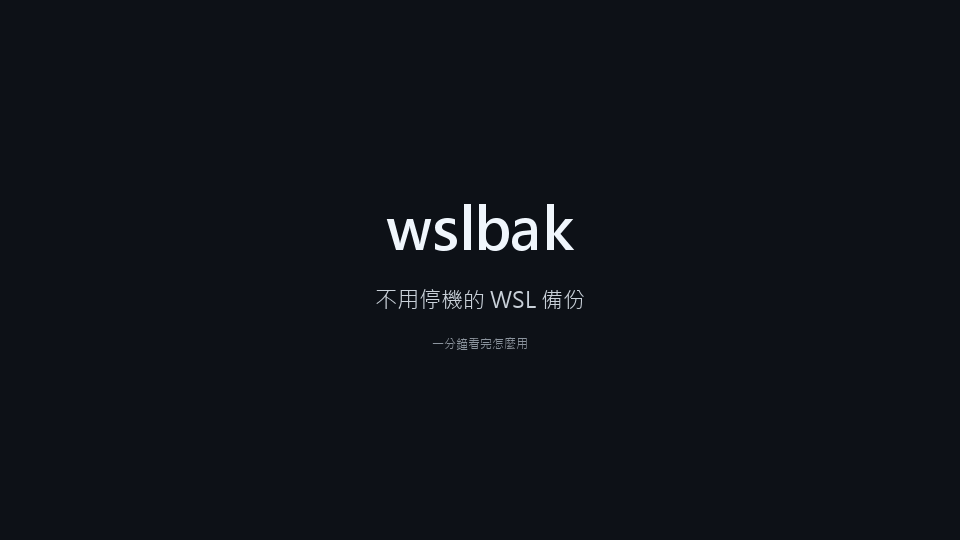

# wslbak

[English](README.md) | **繁體中文**

替 WSL distro 做排程備份：備份時不用停機、每次備份完自動試還原、失敗會通知，還原只要一行指令。

> **狀態：0.1.x，最初的公開版本。** 自動化測試在 18 種 distro 與三個 Windows 組建上實際做過備份、試還原與還原，
> 但還沒有人長期每天使用過。在它於你的電腦上證明可靠之前，請保留你原有的備份。



同樣的內容也有[影片檔](docs/demo.zh-TW.mp4)。這是指令實際執行時的錄影：電腦上真的用 npm 套件裝了 wslbak，
並有一個叫 `wslbak-demo` 的示範用 distro；指令印出來的文字沒有任何修改。
繪製的腳本另外加上了每一步的標題與片頭片尾，指令的打字速度是畫出來的，輸出太長時分頁顯示，等待時間有縮短。

WSL 裡的檔案不在 OneDrive 與大多數備份工具的範圍內。它們全都放在一個虛擬磁碟裡，磁碟損壞或重灌
Windows 之後就什麼都不剩。常見的做法是排程執行 `wsl --export`，但 `wsl --export` 會先把 distro
終止再匯出（WSL 2.7 仍然如此），每跑一次，你開著的 shell、開發伺服器與容器就全部被關掉。`wslbak` 改成從 distro 裡面讀，
distro 照常執行：

```
> wslbak init
> wslbak run
備份 wslbak-demo → D:\WSLBackup\wslbak-demo
  已寫入 20261009T181702Z.tar.gz（91 MB，1 秒）
試還原…
  試還原通過：抽查的 512 個檔案全部相符（2 秒）
完成。
```

（這是上面錄影裡的那一次執行：一個剛裝好、用了 270 MB 的 Debian。平常在用的 distro 比較大，時間也相應比較長。）

- **distro 不會被停止。** 由 distro 裡以 root 執行的 `tar` 把內容串流出來；不會關閉 WSL，也不會寫入
  distro 裡的任何東西。
- **每份備份都試還原過**（除非你自己關掉）。備份檔會被匯入成一個暫時的 distro，檢查後移除。
- **標準格式。** 備份就是一般的 `.tar.gz`，有沒有 wslbak 都能用 `wsl --import` 還原。
- **一個指令設定好**：每日排程、保留幾份、放在哪裡。
- **還原絕不覆蓋。** 整個 distro 會還原成一個新的 distro；單一檔案會取回到一個新的資料夾。

## 安裝

需要 Windows 10 或 11，以及從 Microsoft Store 安裝的 WSL（`wsl --version` 要能執行；不行的話先執行
`wsl --update`）。Windows 10 本身還沒有實際試過，測過哪些環境見[限制](#限制)。

有 Node.js 18 以上的話，在 Windows 的終端機或 WSL 裡都可以安裝：

```
npm install -g wslbak
```

用 [Scoop](https://scoop.sh)：

```
scoop bucket add boring206 https://github.com/Boring206/scoop-bucket
scoop install wslbak
```

兩者都沒有：到 [Releases](https://github.com/Boring206/wslbak/releases) 頁面下載
`wslbak-<版本>-windows-x64.zip`（或 `-arm64`），解壓到任何地方，直接執行裡面的 `wslbak.exe`。
`wslbak.exe` 和 `wslbakw.exe` 要放在一起。

不管用哪一種方式，拿到的都是編好的執行檔，不需要安裝 Go。`wslbak init` 會把它們複製到自己固定的位置，
所以之後下載資料夾、npm 的安裝位置或 Scoop 的資料夾有變動，也不會讓排程失效。

## 開始使用

```
wslbak init
```

`init` 會檢查你的 distro（沒在執行的會為此被啟動）、建議一個存放位置，然後把即將設定的東西列出來
（程式檔、設定檔、登錄機碼、排程工作與它完整的指令列），再問你 `確定嗎？[y/N]`。回答「是」之前不會設定任何東西：
到那時為止，`init` 只建立了它自己的資料夾 `%LOCALAPPDATA%\wslbak` 與裡面的紀錄檔和鎖定檔；
以前設定過 wslbak 的話，還會把已安裝的那份程式更新到目前的版本。加上 `--dry-run` 則只顯示同樣的計畫就結束，
連這些都不建立。整個過程不需要系統管理員權限。有好幾個 distro 時它會問你要哪一個；`--all` 一次全部設定。

預設的存放位置是 `<磁碟>:\WSLBackup`，選的是 distro 所在磁碟以外、可用空間最多的內接磁碟，
這樣重灌 Windows 之後備份還在。電腦沒有這樣的磁碟時，預設改成使用者資料夾裡的 `WSLBackup`；
它和 distro 在同一個磁碟上，重灌時格式化就會一起消失，這種情況請用 `--dest` 指定別的位置。
放到外接碟或 NAS 還能防磁碟本身故障；存放位置和 distro 在同一顆實體磁碟上時，`init` 會告訴你。

`wslbak doctor` 隨時可以把整套設定檢查一遍，並告訴你發現的問題要怎麼處理。

## 用法

```
wslbak init              設定備份與每日排程
wslbak config            顯示設定；加上選項則修改設定
wslbak run               立刻備份、試還原，並清掉過舊的備份
wslbak list              列出備份
wslbak files [編號] [路徑]  列出備份裡某個資料夾的內容
wslbak status            排程、上次結果，以及已安裝的程式是否還在
wslbak doctor            檢查環境與設定，大多數問題都附上修法
wslbak verify [編號]     對既有的備份重新試還原（預設是最新一份）
wslbak restore [編號]    把備份還原成新的 distro（預設是最新一份通過試還原的）
wslbak uninstall         移除排程與已安裝的程式；備份不會被刪除

  -d, --distro <名稱>      指定 distro（預設：init 是唯一可備份的那個，run 是所有設定過的）
      --all                init：一次設定所有可備份的 distro
      --dest <資料夾>      init：備份要放在哪裡
      --keep <份數>        init、config：保留最新幾份已驗證的備份（預設 7）
      --keep-weekly <n>    init、config：另外每週留一份，留 n 週（預設 0）
      --keep-monthly <n>   init、config：另外每月留一份，留 n 個月（預設 0）
      --at <HH:MM>         init、config：每天幾點備份（預設 03:00）
      --webhook <網址>     init、config：失敗時另外通知這個網址；config 可用 off 取消
      --notify <時機>      config：failure（預設）或 always
      --verify <方式>      config：restore（預設）或 none
      --exclude <樣式>     config：多排除一個路徑樣式（可重複）
      --unexclude <樣式>   config：取消一個排除（可重複）
      --enable, --disable  config：啟用或停用某個 distro 的備份
      --private            config：把備份資料夾收緊成只有你的帳號能存取
      --no-verify          run：這次不試還原
      --find <文字>        files：列出檔名或路徑包含這段文字的項目
      --name <名稱>        restore：還原出來的 distro 要叫什麼
      --to <資料夾>        restore：還原出來的 distro 要放在哪裡
      --path <路徑>        restore：只取回這個檔案或資料夾（可重複；要搭配 --into）
      --into <資料夾>      restore：把取回的檔案放進 distro 裡的這個資料夾
  -n, --dry-run            init、config、run、restore、uninstall：只列出會做什麼，不實際執行
  -y, --yes                init、restore、uninstall：不詢問直接進行
      --lang <語言>        介面語言：en 或 zh-TW（也可以設定 WSLBAK_LANG）
      --debug              顯示每個步驟的細節與耗時
  -v, --version            顯示版本
  -h, --help               顯示用法
```

結束碼：`0` 成功（`run --no-verify` 也是）；`1` 備份已寫入但試還原做不了、`files` 沒找到東西，
或 `status`、`doctor`、`config` 發現需要注意的事；`2` 失敗；`3` 已經有另一個 wslbak 在工作。

在 WSL 裡可以直接給 Linux 路徑（`--dest /mnt/d/WSLBackup`），會自動轉換。

## 還原整個 distro

```
wslbak restore
```

會還原最新一份通過試還原的備份；一份都沒通過的話，改用最新的一份，並且會說明。原本名稱的 distro 如果還在，還原出來的會叫 `<名稱>-restored-<日期>`；
也可以用 `--name` 自己指定。既有的 distro 不會被覆蓋、更動或移除，還原出來的那個也不會被自動啟動。

**重灌 Windows 之後**，原本裝在 C: 的 wslbak 也跟著不見了。這時不必重新安裝它，也不需要 Node 或 npm：
wslbak 每次備份時，會把自己的程式（`wslbak.exe`）和一份說明（`README-RESTORE.txt`）複製到備份資料夾裡，
和備份放在一起。所以只要備份資料夾還在（例如在 D: 或外接碟），裝好 WSL 之後直接執行資料夾裡的那一份：

```
D:\WSLBackup\wslbak.exe restore
```

（`D:\WSLBackup` 代表你的備份資料夾：`init` 建議的那個，或你自己指定的那個。）

**完全不用 wslbak 也可以**，備份就是一般的封存檔：

```
wsl --import Ubuntu-24.04 C:\WSL\Ubuntu-24.04 D:\WSLBackup\Ubuntu-24.04\20260115T030000Z.tar.gz --version 2
```

手動匯入的 distro 會以 root 登入；在它的 `/etc/wsl.conf` 加上 `[user]` 與 `default=<你的使用者名稱>`
就能改回來。用 `wslbak restore` 的話，預設使用者會幫你設好。

## 只取回單一檔案

大多數時候你要的不是整個 distro，只是昨天誤刪的那個檔案。

```
wslbak files /home/me/project            最新一份備份裡，那個資料夾有什麼
wslbak files --find notes.md             檔名包含這段文字的檔案在哪裡
wslbak files 20260114T030000Z /etc       看較舊的某一份備份

wslbak restore --path /home/me/project/notes.md --into /home/me/recovered
```

`--path` 可以是檔案或資料夾，也可以重複給好幾個。檔案會放進 `--into` 指定的資料夾，位置在備份來源的那個
distro 裡，完整的路徑會在底下重建：`/home/me/recovered/home/me/project/notes.md`。
那個資料夾必須還不存在（它的上一層要存在）、或是空的，所以你現有的東西絕對不會被蓋掉；取回之後再自己把檔案搬到要的位置。
擁有者、權限、延伸屬性與 ACL 都會保留。

沒有給編號時，`files` 看的是最新的一份備份，不管它有沒有通過驗證；`restore --path` 則和 `restore` 一樣，
用最新一份通過驗證的。兩者要看同一份時，請都給編號。

## 備份了什麼

distro 根檔案系統上的所有東西，包含擁有者、權限、延伸屬性、檔案 capabilities、硬連結與稀疏檔。
socket 會被略過，tar 存不了它。預設不備份：`/tmp` 與 `/var/tmp` 裡的東西、家目錄的 `.cache` 裡的東西，
以及 WSL 自己的 `/init`。`/mnt` 底下的 Windows 磁碟不屬於 distro，一律不會備份。

```
wslbak config                                         顯示設定
wslbak config --exclude "/home/*/Downloads/*"         多排除一個位置
wslbak config --keep 3 --keep-weekly 4 --keep-monthly 6
wslbak config --at 02:30
```

- `--exclude` 是 distro 裡的路徑樣式，`*` 代表任何內容，連 `/` 也算。要加引號，免得 shell 先把 `*` 展開。
- `--keep` 是保留最新幾份已驗證的備份。`--keep-weekly` 與 `--keep-monthly` 會另外留下最近 n 個有備份的週
  （或月）裡各自最新的那一份，本週與本月也算在內，所以會多出幾份較舊的。它們不會讓備份變小。
  要省空間，就排除可以重新下載的東西：`wslbak doctor` 會量出常見快取的大小，並印出排除它的指令。
- `--verify none` 會關掉試還原；這時不分是否驗證過，保留最新的幾份。
- `--notify always` 連成功也通知，這樣沒收到通知就代表排程沒有在跑。
- 要加入另一個 distro，執行 `wslbak init -d <另一個 distro>`。所有 distro 共用同一個每日排程。

設定存在 `%LOCALAPPDATA%\wslbak\config.json`。每份備份是 `<dest>\<distro>\` 裡的三個檔案：
`<編號>.tar.gz`、`<編號>.json`（大小、SHA-256、警告、試還原的結果）與 `<編號>.idx.gz`
（檔案清單，`wslbak files` 用的）。編號是備份當時的 UTC 時間。設定檔旁邊還有 `state.json`（最近的結果）、
`wslbak.log` 與一個鎖定檔；`<dest>` 裡的 `wslbak.exe` 與 `README-RESTORE.txt` 每次備份都會重寫。

## 試還原

備份寫好之後，wslbak 會用 `wsl --import` 把它匯入成一個暫時的 distro，在裡面執行檢查，再把它取消註冊。
檢查的內容是：預設使用者與家目錄都在（預設使用者不是 root 時）；備份讀取過程中隨機挑出的 512 個檔案，SHA-256 和當時一樣；
最大的八個檔案大小和當時一樣（它們太大，不適合每次都算雜湊，卻是匯入時最容易出錯的）。
在這之前，整個備份檔會先被重新讀過一遍，和寫入時記下的 SHA-256 比對。
匯入程式如果抱怨封存有一段讀不懂，就算 WSL 回報成功，試還原也算沒過。

這個暫時的 distro 不可以「活起來」：所有 WSL2 distro 共用同一個網路命名空間，一份忠實的複本一開機，
就會多跑一套你的服務與排程工作，還帶著你的憑證。所以 wslbak 在送去匯入的資料流結尾接上自己的
`/etc/wsl.conf`（磁碟上的備份檔不會被改動），關掉 systemd、開機指令、Windows 磁碟的掛載與互通；
而且除非確認最後留下來的是這一份設定，否則不會啟動複本。

WSL 會替每個匯入的 distro 在開始功能表建立一個資料夾，之後不一定收走；
暫時的 distro 留下的那個空資料夾，wslbak 會自己清掉。

只有通過驗證的備份才算進 `--keep`。沒能驗證的備份另外計算，最多留兩份，
所以連續幾次失敗也不會把好的備份擠掉。

## 通知

備份失敗或沒有驗證時，會跳出 Windows 通知。`--webhook <網址>` 可以再加一個管道：
[ntfy](https://ntfy.sh) 的主題會收到純文字訊息，Discord 與 Slack 的 webhook 網址會收到各自的 JSON 格式。
網址本身視為機密，畫面與紀錄檔只會顯示它的主機名稱（輸入的根本不是網址時，錯誤訊息會把它原樣顯示給你看）。通知只說明是哪一類的問題，不會帶出任何檔名；
細節留在你電腦上的紀錄檔裡。

上次成功已經超過兩天、排程工作不見了、或已安裝的程式消失時，`wslbak status` 會以結束碼 1 結束並說明原因。

## 安全措施

- wslbak 不會對你的 distro 執行 `wsl --shutdown`、`wsl --terminate` 或 `wsl --unregister`。
  程式裡唯一會取消註冊的地方只接受暫時的 distro：名稱是 wslbak 產生的、註冊的位置恰好是
  `%LOCALAPPDATA%\wslbak\verify` 底下屬於它的資料夾、而且 wslbak 替它留過認領檔。
  有一個測試專門確認沒有別的程式路徑能走到那個呼叫。
- 刪除舊備份時一次只刪一個檔案，而且只刪旁邊有 wslbak 的 manifest 的檔案。
  備份資料夾裡的其他檔案都不會動，就算看起來像備份也一樣。
  資料夾裡如果有較新版本的 wslbak 寫的備份，就什麼都不刪。
  唯一的例外是 wslbak 自己沒寫完的檔案 `<編號>.tar.gz.partial`：上次中斷留下的，下次執行時會清掉。
- `restore` 會拒絕已經有人用的名稱，以及不是空的資料夾，還原 distro 與取回檔案都一樣。
- 在你的 distro 裡執行的腳本不會刪除任何東西，也只用到 shell、coreutils 與 tar。
  你替 `--path`、`--into`、`--exclude` 輸入的內容，不會成為任何由 shell 解讀的命令列的一部分：
  `--path` 根本不會進到 distro 裡；另外兩個是當成資料送進去的，只會原樣當作單一個參數交給指令
  （`tar --exclude=…`，以及檢查與填入目的地資料夾的那幾個指令）。
- 來自 distro 裡的檔名，在清單與備份的警告裡顯示時，會把控制字元換成看得見的寫法，
  所以名稱動過手腳的檔案沒辦法對你的終端機下指令。
- 單一檔案只會放回備份資料夾所屬的那個 distro，不管資料夾裡的紀錄怎麼寫。
  檔案先解開到只有 root 進得去的資料夾，最後才搬到目的地（解到一半失敗時也會搬，讓你看得到取回了多少）；
  所以 distro 裡擁有目的地上一層資料夾的使用者，沒辦法靠把目的地換成連結來把檔案引到別處。
- 由其他程式管理的 distro（`docker-desktop*`、`rancher-desktop*`、`podman-machine-*`）與 WSL1 distro
  會被拒絕並說明原因。
- 同一時間只有一個 wslbak 在更動東西。第二個 `init`、`run`、`verify`、修改設定的 `config`、`restore --path`
  或 `uninstall` 會以結束碼 3 結束（排程啟動的那一次發現已經有人在做，就直接結束）。
  只讀不寫的指令，以及把整個 distro 還原成新的，不受這個限制。

## 運作方式

`wsl.exe -d <distro> -u root -e sh -s` 在 distro 裡執行一支小腳本。腳本對 `/` 執行 GNU `tar`
（加上 `--one-file-system`），把原始的封存寫到 stdout。Windows 這一端的 wslbak 用平行 gzip 壓縮、
計算雜湊，寫成 `<編號>.tar.gz.partial`；只有 tar 結束時沒有要緊的錯誤、而且收到的位元組數等於 tar 自己說它寫出的數量時，
才會改名成正式的檔案。（檔案在讀取途中變動或消失，在執行中的系統上是正常的，會列為警告。）

tar 的輸出在途中會被補上一個欄位。8 GiB 以上的檔案，GNU tar 只把大小記在延伸標頭裡，檔案自己的標頭上留的是 0。
WSL 2.7 內附的匯入程式（bsdtar 3.7.7）會相信那個 0：這種檔案還原出來是空的，而 `wsl --import` 照樣回報成功。
wslbak 把真正的大小也寫進那個標頭（標頭的檢查碼跟著更正），備份在那裡也能正確還原。其他內容完全不動，備份仍然是合法的 tar。

排程工作屬於你的 Windows 帳號，在你的登入工作階段裡執行。它啟動的是放在
`%LOCALAPPDATA%\Programs\wslbak` 的無視窗版程式，所以不依賴 Node，也不依賴 distro 裡的任何東西。
工作設定成錯過排定時間後盡快補跑，並在你登入十分鐘後再跑一次
（Windows 不讓你的帳號建立「登入時」的觸發時，就只有每天定時那一個）；
程式發現 20 小時內已經成功備份過，就會直接結束。

## 限制

- **備份當下正在寫入的檔案，在備份裡可能不一致。** 這不是快照。資料庫請用它自己的工具先匯出成檔案，
  那個檔案就能被可靠地備份。
- **還原整個 distro 時，POSIX ACL 不會被還原。** ACL 有存進備份檔，但 `wsl --import` 不會套用。
  `wslbak run` 會告訴你有幾個檔案受影響（systemd 的日誌資料夾每次開機都會重設，不計入）。
  用 `--path` 取回單一檔案時，ACL 會保留。
- **備份沒有加密。** 備份裡是 distro 的全部檔案，私鑰與密碼雜湊都在內。讀得到備份資料夾的人就讀得到這一切；
  寫得進去的人可以改動備份，或換掉放在那裡的那份程式。這台電腦上有其他帳號讀得到時，`wslbak doctor` 會告訴你；
  `wslbak config --private` 會把資料夾收緊成只有你的帳號能存取（另外保留系統與系統管理員）。
  這不是預設值，因為它之後有代價：重灌 Windows 之後，新的帳號不在名單上，
  要先在檔案總管打開那個資料夾並同意它的詢問，或用系統管理員的終端機，才能還原。
  只對別人寫不進去的資料夾裡的備份做驗證與還原：試還原會執行備份裡帶出來的程式。
- **每次都是完整備份。** 目前沒有增量模式。
- **distro 裡要有 GNU tar。** 只有 BusyBox tar 的（剛裝好的 Alpine）或沒有 tar 的（剛裝好的
  openSUSE Tumbleweed）會被拒絕，並附上安裝它的指令。
- **只備份根檔案系統上的東西。** 掛在另一個磁碟上的資料夾會被跳過。它是 Linux 的檔案系統（ext4、xfs、btrfs 之類）
  而且不是掛在 `/mnt/wsl` 底下時，`wslbak run` 會指出是哪一個；網路磁碟、FAT 與 NTFS 的磁碟，
  以及用 `wsl --mount` 掛上的磁碟，會被跳過而沒有訊息。
- **試還原需要可用空間**，位置是 `%LOCALAPPDATA%` 所在的磁碟，最多約等於 distro 裡檔案的總大小。
  空間不夠時，備份會保留並回報為「沒有驗證」，結束碼是 1。
- **排程只在你登入時執行。** distro 當時沒有在執行的話，會為了備份而被啟動。
- **試還原是抽查。** 它證明備份檔匯入得進去、512 個檔案完好、最大的幾個檔案大小正確，
  不是證明每個檔案的每個位元組都完好。
- **單一檔案只能取回到 distro 裡**，不能直接放到 Windows 的資料夾。在 Windows 上可以從
  `\\wsl.localhost\<distro>\<資料夾>` 打開取回的結果。
- **測過哪些環境。** 在 Ubuntu 26.04 上開發。端對端測試通過的有：Debian 12 與 13、Ubuntu 20.04／22.04／24.04、
  Fedora 44、AlmaLinux 8 與 9、Rocky Linux 9（`wsl --install` 提供的 CIQ 版本）、Oracle Linux 7／8／9、Arch Linux、openSUSE Tumbleweed、Kali、Gentoo、
  NixOS、Alpine 3.24（GNU tar 1.26 到 1.35）；WSL 2.7 與 3.0；Windows 11（組建 26300）、Windows Server 2025（組建 26100）
  與 Windows Server 2022（組建 20348，和 Windows 10 同一代）；防毒是 Avast，以及開著即時保護的 Microsoft Defender。開著 Defender 的那個測試環境完整通過過一次；
  另外兩次整個測試環境停止回應（第二次是在等排程自己啟動的時候），原因還不清楚。
  arm64 的執行檔在 arm64 Windows 上能啟動、單元測試通過，但那裡沒有 WSL 可以備份。
  還沒試過的：Windows 10 本身、裝有 Docker Desktop 的電腦、100 GB 以上的 distro，歡迎回報。

## 疑難排解

先執行 `wslbak doctor`。

- **紀錄檔在哪裡？** `%LOCALAPPDATA%\wslbak\wslbak.log`。內容是英文，但同時顯示給你看的那些訊息，
  記下來的是介面語言的版本。加上 `--debug` 可以即時看到。
- **Windows 拒絕執行程式。** 執行檔沒有程式碼簽章。智慧型應用程式控制（Smart App Control）
  會直接擋下沒有簽章的程式，開著它的時候 wslbak 無法執行；公司管理的電腦上，AppLocker 或 WDAC
  原則也可能有同樣的效果。
- **防毒軟體在程式第一次執行時把它扣住。** 有些產品（例如 Avast 與 AVG）遇到沒看過的程式，
  會先檢查一陣子，或把它關進沙箱裡執行；在沙箱裡 wslbak 連不上 WSL。所以 `init` 會趁你在場時，
  先把安裝好的程式執行一次。如果排程的備份一直沒有執行，把 `%LOCALAPPDATA%\Programs\wslbak`
  加入防毒軟體的例外清單。請不要關閉防毒軟體。
- **`status` 說已安裝的程式不見了。** 可能被防毒軟體隔離了。從防毒軟體的紀錄把它還原，
  再執行一次 `wslbak init` 把檔案補回來。
- **init 時出現「無法寫入…」。** 開啟了「受控資料夾存取」的話，請在 Windows 安全性裡允許這支程式，
  或換一個不受保護的資料夾。
- **另一個 distro 停止之後，WSL 裡的 `.exe` 都無法執行（Exec format error）。**
  這不是 wslbak 造成的：有些 distro 關閉時，會清掉所有 distro 共用的一項核心設定。
  實際看過的有 Fedora 44、openSUSE Tumbleweed 與 Rocky Linux 9。
  它可能出現在備份之後，因為備份會把沒在執行的 distro 啟動，之後它又自己停止。
  執行 `wsl --shutdown` 可以恢復；不想重啟的話，在 Windows 的終端機執行：
  `wsl -u root sh -c "echo ':WSLInterop:M::MZ::/init:P' > /proc/sys/fs/binfmt_misc/register"`。
- **在 WSL 裡出現「無法執行 Windows 程式」。** Windows 互通被停用了；檢查 `/etc/wsl.conf` 的
  `[interop]` 區段，或改從 Windows 使用 wslbak。
- **在 Git Bash 裡，`--path`、`--into` 與 `files <路徑>` 會被當成 Windows 路徑而拒絕。** Git Bash 會把看起來像
  Linux 路徑的參數改寫掉（`/home/me` 變成 `C:/Program Files/Git/home/me`），wslbak 收到的已經是改過的；
  它會發現並告訴你。在指令前面加上 `MSYS_NO_PATHCONV=1`，或改用 PowerShell、cmd 或 WSL 的 shell。

## 開發

需要 Go 1.26 以上與 Node.js。程式遵守的規則見 [CONTRIBUTING.md](CONTRIBUTING.md)，整體結構見
[docs/ARCHITECTURE.md](docs/ARCHITECTURE.md)，回報安全性問題的方式見 [SECURITY.md](SECURITY.md)（這三份是英文）。

```
npm test         # go vet 加上單元測試
npm run build    # 編出 bin/ 底下的四個執行檔（以及測試用的一支輔助程式）
npm run e2e      # 端對端測試：在 WSL 裡對一個拋棄式的 distro 與沙箱資料夾執行
npm run dist     # 在 dist/ 產生發佈用的 zip、檢查碼，以及 winget 與 scoop 的套件清單
```

`bash scripts/demo.sh` 會重做這一頁開頭的示範：安裝打包好的 npm 套件與一個示範用的 distro，實際執行指令
（用的是真正的設定資料夾、排程工作與預設資料夾，所以電腦上已經設定過 wslbak 時它會拒絕開始），
把輸出錄下來畫成動畫，最後移除它建立的東西。它需要先執行過 `npm run build`、WSL 裡有 python3、
Windows 上有裝 Pillow 的 Python；要產生影片檔還需要 ffmpeg。

`npm run e2e` 第一次執行時會建立名為 `wslbak-e2e-<亂數>` 的 Debian distro；設定 `KEEP_E2E_DISTRO=1`
可以把它留到下次再用，`scripts/e2e-distro.sh destroy` 則把它移除。設定 `E2E_DISTRO` 可以測試別的家族
（`FedoraLinux-44`、`archlinux`、`openSUSE-Tumbleweed`、`alpine`…），`E2E_ROOTFS_URL` 則匯入
`wsl --install` 沒有提供的根檔案系統。`E2E_FAST=1` 略過只和 Windows 有關的部分，`E2E_TOAST=1`
加入一項會真的跳出通知的檢查。另外有兩支比較慢、要手動執行的腳本：`scripts/e2e-scale.sh`
（數百萬個檔案、超過 8 GiB 的單一檔案）與 `scripts/e2e-services.sh`（忙碌中的 Docker Engine 與正在寫入的 SQLite 資料庫）。
測試不會碰其他的 distro，也不會碰你真正的 wslbak 設定。

有幾種狀況是靠開關做出來的，這些開關只有和沙箱選項 `--home` 一起用才有作用：
`testhooks.go` 裡那些 `WSLBAK_TEST_…` 環境變數。正常使用時它們不做任何事。在 WSL 裡開發而那裡沒有安裝 Go 時，建置腳本會退回使用 Windows 上的
`go.exe`；要指定別的位置，設定環境變數 `GO`。

程式的介面文字都在 `i18n.go`，每種語言各一份。改動訊息時兩份都要改，測試會檢查有沒有漏掉。
（npm 的啟動器 `bin/wslbak.js` 另有幾則自己的訊息。）

## 授權

[MIT](LICENSE)
